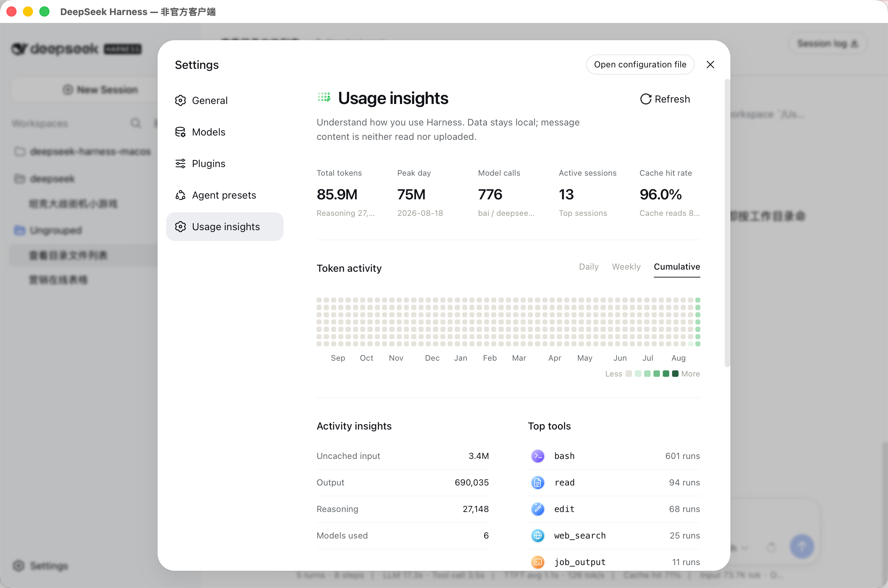

# Harness Insights

[中文文档](./README.zh-CN.md)

A bundled Cordis plugin for DeepSeek Harness. It adds a local-first **Usage insights** settings page without modifying upstream Harness source.

Published package: `@anarkhgatsby/deepseek-harness-insights`.

## Preview

The plugin adds a **Usage insights** page under Harness settings, with token
activity, model usage, active sessions, cache hit rate, activity breakdown, and
the most frequently used tools.

- **Dual-Theme Support**:
  - ☀️ Light Mode: Pure classic emerald/forest green gradient.
  - 🌙 Dark Mode: Codex-inspired deep obsidian canvas with vibrant neon hot-pink/magenta (`#ff3388`) saturation curve.
- **Golden Ratio Heatmap Matrix**: Dense, breathable 2.7px grid spacing with enlarged cells.



## Install as a Harness bundle

The package follows the official Harness bundle manifest and can be installed
into a profile with `dsh plugin`:

```bash
dsh plugin --profile demo add @anarkhgatsby/deepseek-harness-insights
dsh --profile demo
```

To remove it later:

```bash
dsh plugin --profile demo remove @anarkhgatsby/deepseek-harness-insights
```

The plugin is web-only and targets the `0.1.2-alpha.5` Harness projection and
client APIs. It is an independent, unofficial community plugin and is not
published by DeepSeek.

For local development, the same bundle can be installed from a checkout:

```bash
dsh plugin --profile demo add ./packages/harness-insights
```

The package also retains its `dsh.client` metadata so the browser entry is
loaded with the required Harness client services.

## Data boundary

Harness Insights folds only structured session metadata:

- `assistant/message.data.usage`
- `assistant/message.data.message.source.provider/model`
- `tool/call.data.name`
- event timestamps and session projection identity

It does not request session history in the browser, store message content, read API keys, or upload usage data. Historical aggregation runs through Harness's official `sessionProjectionCache.coldSnapshot()` path and persists only the projection checkpoint owned by Harness.

## Packaging

The package is developed independently under `packages/harness-insights` and copied into each bundled runtime at build time. Harness Desktop deploys its tiny pure-JavaScript runtime copy to the standard out-of-tree plugin root under `$DSH_HOME/node_modules` and loads it through a `--patch` overlay.

The plugin contains no architecture-specific native modules and is shared by macOS arm64, macOS x86_64, and Windows x86_64 builds.

## Tool icon assets

`assets/tool-icons` contains the project-provided Codex-style Harness tool icon set: 26 matching SVG pairs for light and dark interfaces. The build embeds the optimized pairs into the client bundle; the UI switches them through Harness's `body[data-ds-dark-theme]` contract without its own theme preference.
