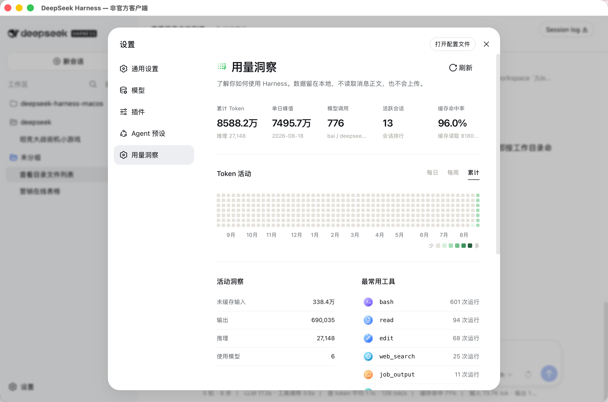

# Harness Insights

[English README](./README.md)

Harness Insights 是一个面向 DeepSeek Harness 的非官方 Cordis 插件，为 Web UI 增加本地优先的「用量洞察」设置页面，不修改 Harness 上游源码。

## 界面预览

插件会在 Harness 的设置中增加「用量洞察」页面，展示 Token 活动、模型调用、活跃会话、缓存命中率、活动统计和常用工具等信息。



## 安装

插件遵循 Harness 官方 bundle manifest，可以直接安装到 profile：

```bash
dsh plugin --profile demo add @anarkhgatsby/deepseek-harness-insights
dsh --profile demo
```

移除插件：

```bash
dsh plugin --profile demo remove @anarkhgatsby/deepseek-harness-insights
```

本地 checkout 也可以直接安装：

```bash
dsh plugin --profile demo add ./packages/harness-insights
```

## 功能

- 在设置中显示会话用量、模型、工具调用和活动趋势
- 使用 Harness 的官方 session projection 接口读取结构化元数据
- **双主题尊享调色**：
  - ☀️ 浅色模式：经典自然翡翠绿阶梯，清新通透；
  - 🌙 黑暗模式：Codex 标志性深曜石夜空底色 + 高饱和霓虹电光热粉紫光阶（`#ff3388`）；
- **黄金比例热力图点阵**：方块饱满充实，2.7px 黄金呼吸感间距，消除空旷感
- 不修改 DeepSeek Harness 上游源码

## 数据边界

插件只读取以下结构化会话元数据：

- `assistant/message.data.usage`
- `assistant/message.data.message.source.provider/model`
- `tool/call.data.name`
- 事件时间戳和会话 projection 标识

插件不会：

- 在浏览器中请求或保存完整对话内容
- 读取 API Key
- 上传用量数据到第三方服务

历史聚合在本地 Host 中通过 Harness 官方的 session projection 接口完成，只保存 Harness 自己管理的派生 projection checkpoint。

## 兼容性

- Harness projection/client API：兼容旧版 `0.1.2+` 与新版 `0.1.5+`
- 运行平台：Web UI
- 插件类型：npm bundle
- 当前版本：`0.1.8`

当 Harness 运行时升级后，插件会在首次启动时在本地重建历史会话的派生投影缓存。若旧版子代理日志已被新版 Harness 停止支持，插件会在核对会话生命周期后，仅恢复此前本地保存的用量聚合值；不会读取聊天正文，也不会改动其他 DSH 内部投影。历史会话较多时数据会逐步显示；整个过程不会上传任何数据。

## 兼容性与依赖

| 项目 | 支持或已验证的版本 |
| --- | --- |
| Harness Host | 旧版缓存 API `0.1.2+`；新版会话持久化 API `0.1.5+` |
| 已验证的当前运行时 | DeepSeek Harness `0.1.5-alpha.1` |
| Cordis | `^4.0.1` |
| Harness projection/client 服务 | `^0.1.5-alpha.1` |
| 插件发布版本 | `@anarkhgatsby/deepseek-harness-insights@0.1.8` |

桌面端 `0.3.5` 内嵌的正是该 `0.1.8` 版本。插件不含原生依赖，只通过本地 Harness Host 工作。

Harness 目前仍处于 developer preview 阶段，未来版本可能存在兼容性变化。

## 开发

```bash
node tests/projection.test.mjs
node tests/client-activity.test.mjs
node tests/manifest.test.mjs
npm pack --dry-run
```

## 说明

这是一个独立的非官方社区插件，由 `mapan0424` 发布，不代表 DeepSeek 官方立场，也不是由 DeepSeek 官方发布的插件。

项目地址：[github.com/mapan0424/deepseek-harness-insights](https://github.com/mapan0424/deepseek-harness-insights)

## 许可证

MIT
